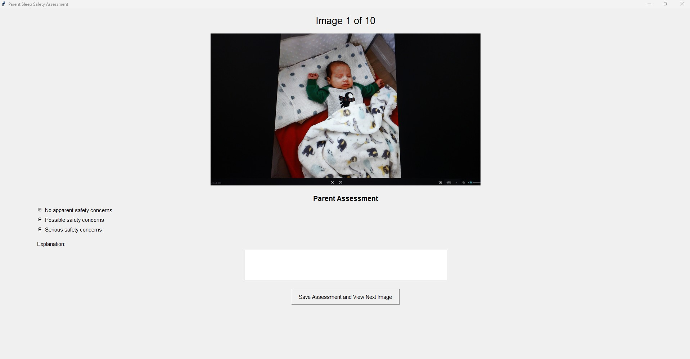
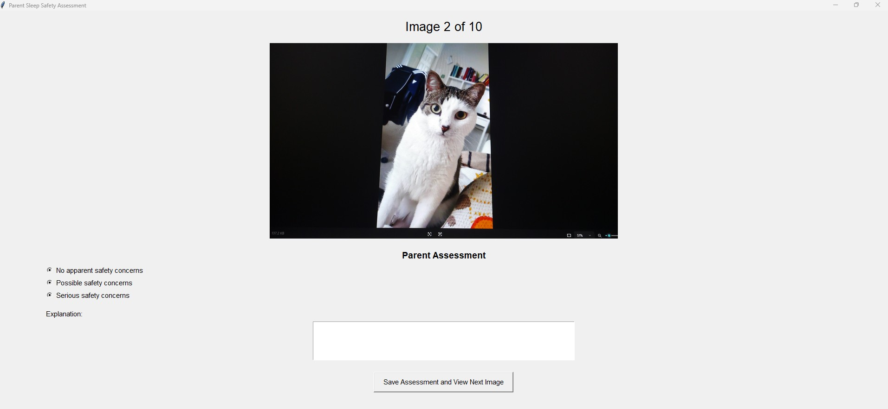
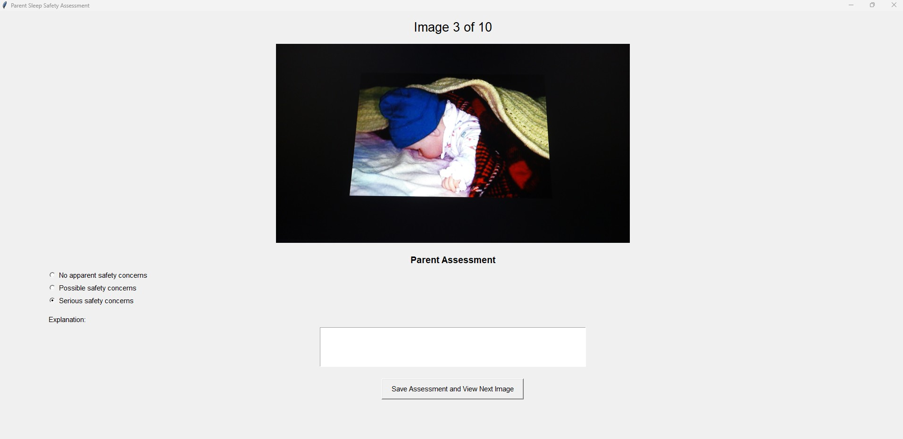
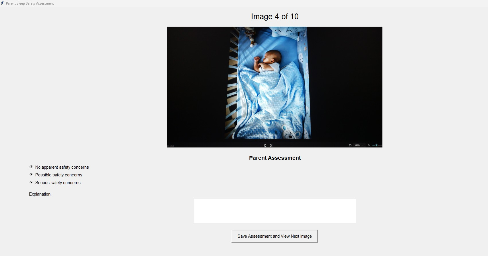
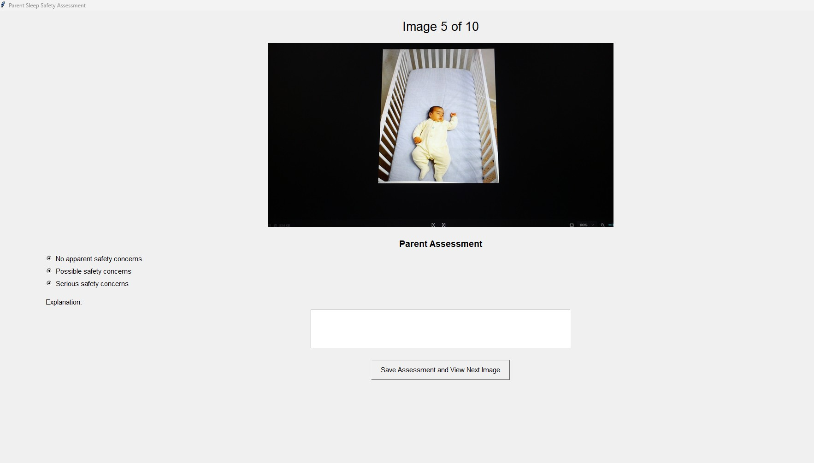
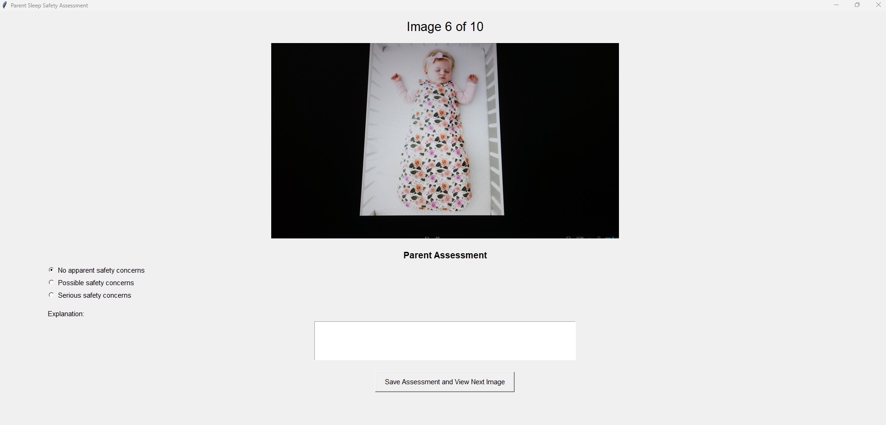
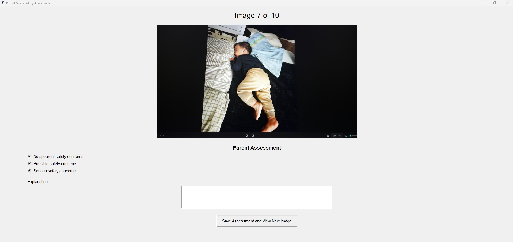
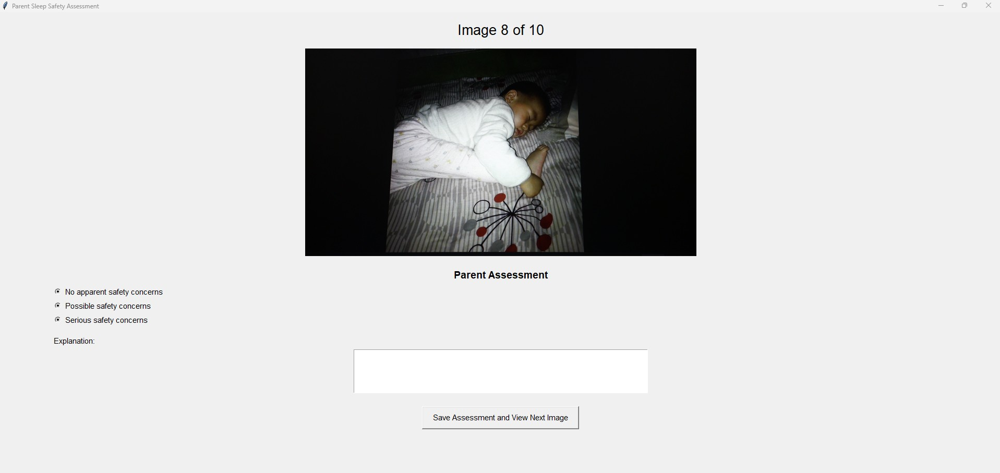
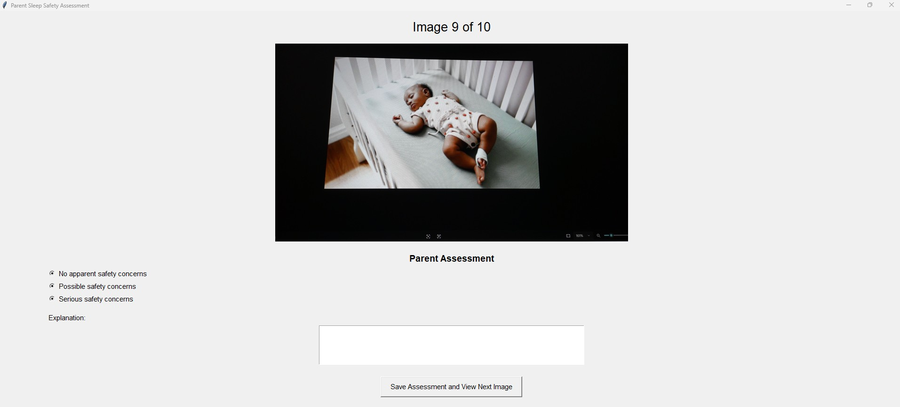
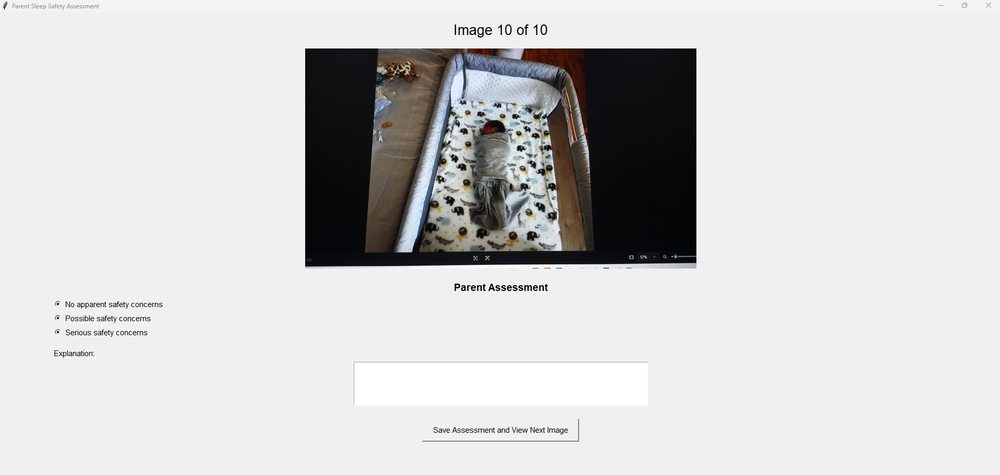

# AI Infant Sleep Monitoring System

Independent study project exploring multimodal AI vision models for infant sleep monitoring.

The system uses a Raspberry Pi Camera Module 3 to capture still images of a sleep environment. The images are transferred to a laptop, processed by multiple multimodal AI models, and stored in a SQLite database. After a monitoring session, a parent reviews the captured images through a basic graphical interface and assigns a reference safety assessment. The parent assessment is then compared with the assessment returned by each AI model.

This project currently evaluates images rather than continuous video.

#### Core Question:
"Can existing multimodal AI models provide assessments of infant sleep environments in a way that is reliable enough to assist parents in infant sleep monitoring?"

## System Requirements
- Raspberry Pi
- Raspberry Pi Camera Module 3
- Windows, macOS, or Linux
- Python 3.12 or newer
- Network access to the Raspberry Pi

## System Architecture

The experimental system consists of a Raspberry Pi and a laptop.

### Raspberry Pi

The part of the system that exist in the Raspberry Pi is responsible for:

- Controlling the Camera Module 3 (**camera_script.py**)
- Capturing high-resolution still images
- Running a Flask camera service (**camera_servicing.py**)
- Responding to HTTP capture requests
- Returning captured JPEG image files to the laptop

### Laptop

The part of the system that exist in the laptop is responsible for:

- Starting a monitoring session (**app.py**)
- Requesting images from the Raspberry Pi via HTTP 
- Saving captured images locally
- Inserting image metadata into SQLite database (**database.py**)
- Processing each image to AI models for assessment (**ai_processing.py**)
- Validating and storing AI responses
- Collecting parent reference assessments (**parent_gui.py**)
- Comparing AI assessments with parent assessments

## Application Workflow

Laptop user begins a monitoring session from the Python application.

(Provides the desired monitoring session duration and image capture interval.)

↓

Laptop sends http POST request to Raspberry Pi /capture endpoint in Flask server.

↓

Raspberry Pi captures a still image using the Camera Module 3 and saves the JPEG locally.

↓

Flask sends the JPEG bytes to the laptop and laptop saves its own local copy.

↓

Image metadata is inserted into SQLite database. 

↓

Image is processed by each AI model using a standardized prompt and JSON response schema.

↓

Valid or invalid AI responses are stored.


↓

Monitoring session finishes and the parent assessment GUI opens.

↓

The parent reviews each captured image and provides a safety assessment.

(Uses the same JSON response structure as the AI models)

↓

Parent assessments are stored in the SQLite database.

↓

The application compares each AI model's assessment with the parent reference assessment.

↓

A comparison table and agreement summary are displayed in the Python console.


## Project Directory Structure

```text
ai-infant-sleep-monitoring-system/
├── database/
│   └── ism.db
│
├── images/
│
├── previews/
│
├── raspberry-pi/
│   ├── camera_script.py
│   ├── camera_servicing.py
│
├── results/
│   └── updated_run/
│       ├── gemini_outputs/
│       ├── gemini_invalid_outputs/
│       ├── openai_outputs/
│       ├── openai_invalid_outputs/
│       ├── anthropic_outputs/
│       ├── anthropic_invalid_outputs/
│       ├── mistral_outputs/
│       └── mistral_invalid_outputs/
│
├── ai_processing.py
├── app.py
├── database.py
├── parent_gui.py
├── preview_camera.py
├── .env
├── .gitignore
└── README.md
```


## How to Run

### Camera Preview

Verify camera placement before starting a monitoring session.

### Run monitoring session

Start the Flask server on the Raspberry Pi so that client request from laptop can be heard.

Run the monitoring application, app.py with set duration and intervals.

After the monitoring session completes, the Parent GUI opens to collect parent assessment.

For each captured image, the parent:
- Reviews the image presented.
- Selects one safety assessment.
- Enters a brief explanation.

### Comparison Analysis

After all parent assessments have been completed, the application:

- Compares each AI model with the parent reference assessment.
- Displays a comparison table.
- Calculates agreement for each AI model.

Agreement (as a percentage) is reported as:
```
Exact Matches / Total Comparisons
```

## Example Monitoring Session

The following example demonstrates a successful monitoring session consisting of 10 captured images. For demonstration purposes, the images were captured beforehand as part of a sample dataset. Once the monitoring session is complete, the Parent Assessment GUI is displayed to collect the parent reference assessments all at once, followed by the comparison results and agreement summary. If any AI model returns an invalid response, an Invalid Response Summary is also displayed.
### Parent Assessment GUI and AI Assessment Explanations




```text
Image File                    AI Model            Parent Truth Label            AI Model Label                Match
______________________________________________________________________________________________________________________________________________________

capture_20260805_222214.jpg   Claude Sonnet 4-6   Serious safety concerns       Serious safety concerns       Yes
Parent Explanation: The infant's head is resting on some blankets. There is a loose blanket covering the lower half of their body. If the infant was to move around, some of these blankets could cover their face causing a serious safety concern.
AI Model Explanation: This newborn/young infant is sleeping with multiple serious safety hazards present: (1) a loose, fluffy blanket covering the baby's body and near the face, posing a suffocation risk; (2) what appears to be a soft, polka-dot padded surface or pillow beneath the baby, which is not a firm, flat sleep surface as recommended; (3) a pillow visible at the top of the sleep area. Safe sleep guidelines (AAP) recommend a firm, flat surface with no loose bedding, pillows, or soft objects in the sleep environment for infants.

______________________________________________________________________________________________________________________________________________________

capture_20260805_222214.jpg   GPT-4.1 Mini        Serious safety concerns       Possible safety concerns      No
Parent Explanation: The infant's head is resting on some blankets. There is a loose blanket covering the lower half of their body. If the infant was to move around, some of these blankets could cover their face causing a serious safety concern.
AI Model Explanation: The baby is sleeping on a pillow, which is generally not recommended due to the risk of suffocation or Sudden Infant Death Syndrome (SIDS). Additionally, there is a loose blanket covering the baby, which can also pose a suffocation hazard. These factors are potential safety concerns.

______________________________________________________________________________________________________________________________________________________

capture_20260805_222214.jpg   Gemini 2.5 Flash    Serious safety concerns       Serious safety concerns       Yes
Parent Explanation: The infant's head is resting on some blankets. There is a loose blanket covering the lower half of their body. If the infant was to move around, some of these blankets could cover their face causing a serious safety concern.
AI Model Explanation: The infant is sleeping with multiple loose blankets, including one covering the lower body and another bunched near the head, as well as a folded cloth/small blanket/pillow directly under the head. These items are soft and loose, posing a serious suffocation and rebreathing hazard for an infant.

______________________________________________________________________________________________________________________________________________________

capture_20260805_222214.jpg   Mistral Medium 3.5  Serious safety concerns       Possible safety concerns      No
Parent Explanation: The infant's head is resting on some blankets. There is a loose blanket covering the lower half of their body. If the infant was to move around, some of these blankets could cover their face causing a serious safety concern.
AI Model Explanation: The baby is sleeping on a soft, padded surface with blankets and pillows, which may pose a risk of suffocation or Sudden Infant Death Syndrome (SIDS). The environment lacks a firm, flat sleep surface as recommended for safe infant sleep.
```



```text
______________________________________________________________________________________________________________________________________________________

capture_20260805_222300.jpg   GPT-4.1 Mini        No apparent safety concerns   Possible safety concerns      No
Parent Explanation: This is not a relevant image. Assigning no safety concern.
AI Model Explanation: The image shows a cat in what appears to be a sleeping or resting area. While there are no direct hazards visible such as sharp objects or loose bedding, the presence of a pet in a child's sleep environment may pose possible safety concerns due to allergies, potential for suffocation, or scratching. Therefore, possible safety concerns are noted.

______________________________________________________________________________________________________________________________________________________

capture_20260805_222300.jpg   Gemini 2.5 Flash    No apparent safety concerns   No apparent safety concerns   Yes
Parent Explanation: This is not a relevant image. Assigning no safety concern.
AI Model Explanation: The image provided does not depict a child sleep environment. It primarily shows a cat and a general room background, making it impossible to assess any safety concerns specifically related to a child's sleeping area.

______________________________________________________________________________________________________________________________________________________

capture_20260805_222300.jpg   Mistral Medium 3.5  No apparent safety concerns   Possible safety concerns      No
Parent Explanation: This is not a relevant image. Assigning no safety concern.
AI Model Explanation: The image shows a cat on a bed, which is not a child sleep environment. However, if this were a child's room, the presence of a pet on the bed could pose possible safety concerns such as allergies or hygiene issues.
```

```text
______________________________________________________________________________________________________________________________________________________

capture_20260805_222344.jpg   Claude Sonnet 4-6   Serious safety concerns       Serious safety concerns       Yes
Parent Explanation: There are heavy blankets covering an infant who is sleeping on their stomach. The surface the infant is laying face down in appears soft. There is serious concern for suffocatio here.
AI Model Explanation: The infant appears to be sleeping in a prone (face-down/side) position with loose, heavy blankets/coverings draped over and around the baby's head and body. There are multiple soft bedding items including what appears to be a knitted blanket and a plaid blanket covering the infant. These conditions — loose soft bedding near the face, heavy blankets over the head area, and possible prone positioning — present serious suffocation and SIDS risk factors contrary to safe sleep guidelines, which recommend back sleeping on a firm, flat surface with no loose bedding.

______________________________________________________________________________________________________________________________________________________

capture_20260805_222344.jpg   GPT-4.1 Mini        Serious safety concerns       Possible safety concerns      No
Parent Explanation: There are heavy blankets covering an infant who is sleeping on their stomach. The surface the infant is laying face down in appears soft. There is serious concern for suffocatio here.
AI Model Explanation: The baby is sleeping face down, which poses a risk of suffocation and is not recommended for infant sleep safety. Additionally, the baby is covered with multiple blankets and wearing a hat, which increases the risk of overheating. These factors indicate possible safety concerns.

______________________________________________________________________________________________________________________________________________________

capture_20260805_222344.jpg   Gemini 2.5 Flash    Serious safety concerns       Serious safety concerns       Yes
Parent Explanation: There are heavy blankets covering an infant who is sleeping on their stomach. The surface the infant is laying face down in appears soft. There is serious concern for suffocatio here.
AI Model Explanation: The infant is sleeping on their stomach (prone position), which is a serious risk factor for SIDS. Additionally, the infant is covered with loose blankets, which poses a suffocation hazard. The infant is also wearing a hat, which can lead to overheating.

______________________________________________________________________________________________________________________________________________________

capture_20260805_222344.jpg   Mistral Medium 3.5  Serious safety concerns       Possible safety concerns      No
Parent Explanation: There are heavy blankets covering an infant who is sleeping on their stomach. The surface the infant is laying face down in appears soft. There is serious concern for suffocatio here.
AI Model Explanation: The child is sleeping in a basket, which may not provide a firm or stable sleep surface. Additionally, the blanket appears loose and could pose a suffocation risk.
```


```text
______________________________________________________________________________________________________________________________________________________

capture_20260805_222425.jpg   Claude Sonnet 4-6   Possible safety concerns      Serious safety concerns       No
Parent Explanation: There is a blanket covering the lower part of the infant's body which can cause a risk of them getting it over their face, but that appears to be less likely given that the sleeping surface appears otherwise appropriate. Pillows in the back appear big and like they could bounce away if they come near infant's head space.
AI Model Explanation: The infant is sleeping with multiple serious safety hazards present: (1) a loose, bulky blanket covering the baby, which poses a suffocation/SIDS risk; (2) a pillow or decorative cushion visible at the top of the crib near the baby's head; (3) a bumper pad lining the crib sides, which is not recommended due to entrapment and suffocation risks; (4) a stuffed animal/toy in the sleep space near the baby's feet. Safe sleep guidelines recommend a firm, flat mattress with a fitted sheet only, with no loose bedding, pillows, bumpers, or soft objects in the crib for infants.

______________________________________________________________________________________________________________________________________________________

capture_20260805_222425.jpg   GPT-4.1 Mini        Possible safety concerns      Possible safety concerns      Yes
Parent Explanation: There is a blanket covering the lower part of the infant's body which can cause a risk of them getting it over their face, but that appears to be less likely given that the sleeping surface appears otherwise appropriate. Pillows in the back appear big and like they could bounce away if they come near infant's head space.
AI Model Explanation: The baby is sleeping on their back in a crib with a fitted sheet. However, there is a blanket covering the baby that could pose a suffocation risk. Additionally, there are a couple of soft toys and padded bumpers along the crib sides, which are generally not recommended due to potential suffocation or entrapment hazards. These factors indicate possible safety concerns in the sleep environment.

______________________________________________________________________________________________________________________________________________________

capture_20260805_222425.jpg   Gemini 2.5 Flash    Possible safety concerns      Serious safety concerns       No
Parent Explanation: There is a blanket covering the lower part of the infant's body which can cause a risk of them getting it over their face, but that appears to be less likely given that the sleeping surface appears otherwise appropriate. Pillows in the back appear big and like they could bounce away if they come near infant's head space.
AI Model Explanation: The infant is sleeping on their side, which is not the recommended back-to-sleep position. There is a loose, soft blanket covering the baby, which poses a suffocation hazard. Additionally, there are multiple soft toys/stuffed animals and what appears to be a padded crib bumper in the sleep environment, all of which increase the risk of suffocation or entrapment.

______________________________________________________________________________________________________________________________________________________

capture_20260805_222425.jpg   Mistral Medium 3.5  Possible safety concerns      No apparent safety concerns   No
Parent Explanation: There is a blanket covering the lower part of the infant's body which can cause a risk of them getting it over their face, but that appears to be less likely given that the sleeping surface appears otherwise appropriate. Pillows in the back appear big and like they could bounce away if they come near infant's head space.
AI Model Explanation: The crib has a firm mattress, fitted sheet, and no loose bedding, pillows, or toys within the baby's reach. The environment appears free of immediate hazards.
```



```text
______________________________________________________________________________________________________________________________________________________

capture_20260805_222506.jpg   Claude Sonnet 4-6   No apparent safety concerns   No apparent safety concerns   Yes
Parent Explanation: Appropriate sleeping environment for infant.
AI Model Explanation: The infant is placed on their back in a standard white crib with slats. The sleep surface appears to be a firm, flat mattress with a fitted sheet. No pillows, blankets, bumper pads, stuffed animals, or other soft objects are visible in the crib. The baby is dressed in a footed sleeper, which is appropriate. The crib appears to be in good condition with properly spaced slats. This setup aligns well with safe sleep guidelines.

______________________________________________________________________________________________________________________________________________________

capture_20260805_222506.jpg   GPT-4.1 Mini        No apparent safety concerns   No apparent safety concerns   Yes
Parent Explanation: Appropriate sleeping environment for infant.
AI Model Explanation: The baby is sleeping alone in a crib with a firm mattress and no loose bedding, toys, or pillows present. The baby is placed on their back, which is a safe sleep position. The sleep environment appears to be clear and free of hazards.

______________________________________________________________________________________________________________________________________________________

capture_20260805_222506.jpg   Gemini 2.5 Flash    No apparent safety concerns   No apparent safety concerns   Yes
Parent Explanation: Appropriate sleeping environment for infant.
AI Model Explanation: The baby is sleeping on its back in a bare crib with a firm mattress and fitted sheet. There are no loose blankets, pillows, or toys present, and the baby is dressed in a one-piece sleepsuit, all of which align with safe sleep guidelines.

______________________________________________________________________________________________________________________________________________________

capture_20260805_222506.jpg   Mistral Medium 3.5  No apparent safety concerns   No apparent safety concerns   Yes
Parent Explanation: Appropriate sleeping environment for infant.
AI Model Explanation: The crib has a firm mattress with a fitted sheet, no loose bedding, pillows, or toys, and the baby is placed on their back. The crib bars are appropriately spaced and the environment appears free of immediate hazards.
```

```text
______________________________________________________________________________________________________________________________________________________

capture_20260805_222548.jpg   Claude Sonnet 4-6   No apparent safety concerns   No apparent safety concerns   Yes
Parent Explanation: Sleeping environment appears appropriate.
AI Model Explanation: The infant is sleeping on their back in a crib with a firm, flat mattress and fitted sheet. The baby is wearing a sleep sack (wearable blanket), which is a safe alternative to loose blankets. No pillows, loose bedding, bumper pads, stuffed animals, or other soft objects are visible in the sleep space. The crib slats appear properly spaced. This setup aligns well with safe sleep guidelines.

______________________________________________________________________________________________________________________________________________________

capture_20260805_222548.jpg   GPT-4.1 Mini        No apparent safety concerns   No apparent safety concerns   Yes
Parent Explanation: Sleeping environment appears appropriate.
AI Model Explanation: The child is sleeping alone on their back in a crib with a firm, flat mattress. There are no loose blankets, pillows, stuffed animals, or other objects that could pose a suffocation risk. The sleep sack worn by the child replaces loose bedding, which is a safe sleep practice.

______________________________________________________________________________________________________________________________________________________

capture_20260805_222548.jpg   Gemini 2.5 Flash    No apparent safety concerns   Possible safety concerns      No
Parent Explanation: Sleeping environment appears appropriate.
AI Model Explanation: The child is wearing a headband with a bow. Headbands, hats, or other accessories on the head are generally not recommended for safe sleep due to potential strangulation hazards, choking risks if parts detach, or overheating.

______________________________________________________________________________________________________________________________________________________

capture_20260805_222548.jpg   Mistral Medium 3.5  No apparent safety concerns   No apparent safety concerns   Yes
Parent Explanation: Sleeping environment appears appropriate.
AI Model Explanation: The child is sleeping in a crib with a fitted sheet, no loose bedding, pillows, or toys are present, and the sleepwear appears appropriate for the environment.
```



```text
______________________________________________________________________________________________________________________________________________________

capture_20260805_222654.jpg   Claude Sonnet 4-6   Possible safety concerns      Possible safety concerns      Yes
Parent Explanation: Child appears to be sleeping on thin mattresses on the floor. Since the mattresses are thin and child appears to be old enough, I am assigning possible safety concern; the child can move their face to breathe if they do become uncomfortable from their sleeping area.
AI Model Explanation: The infant appears to be sleeping on what looks like an adult bed or soft surface (possibly the floor with soft bedding). There are soft items nearby including what appears to be a blanket/towel to the right of the child and a pillow-like item near the head. The child appears to be sleeping on their stomach (prone position), which is not recommended for infants as it increases SIDS risk. The presence of soft bedding items nearby also poses potential suffocation hazards. These factors constitute possible safety concerns.

______________________________________________________________________________________________________________________________________________________

capture_20260805_222654.jpg   GPT-4.1 Mini        Possible safety concerns      Possible safety concerns      Yes
Parent Explanation: Child appears to be sleeping on thin mattresses on the floor. Since the mattresses are thin and child appears to be old enough, I am assigning possible safety concern; the child can move their face to breathe if they do become uncomfortable from their sleeping area.
AI Model Explanation: The baby is sleeping on a soft surface with multiple pillows around. Presence of pillows and soft bedding can pose a suffocation risk. Although there are no obvious hazards like loose blankets, toys, or cords, the softness of the sleep area and pillows leads to possible safety concerns.

______________________________________________________________________________________________________________________________________________________

capture_20260805_222654.jpg   Gemini 2.5 Flash    Possible safety concerns      Serious safety concerns       No
Parent Explanation: Child appears to be sleeping on thin mattresses on the floor. Since the mattresses are thin and child appears to be old enough, I am assigning possible safety concern; the child can move their face to breathe if they do become uncomfortable from their sleeping area.
AI Model Explanation: The child, appearing to be an infant, is sleeping on their stomach, which is a known risk factor for SIDS. Additionally, there is a soft pillow under the child's head and a loose blanket/cloth near their upper body, both of which pose suffocation and entrapment hazards for infants. The sleep surface appears to be an adult bed, which is generally not recommended for infant sleep due to potential entrapment risks and the presence of soft bedding.

______________________________________________________________________________________________________________________________________________________

capture_20260805_222654.jpg   Mistral Medium 3.5  Possible safety concerns      Possible safety concerns      Yes
Parent Explanation: Child appears to be sleeping on thin mattresses on the floor. Since the mattresses are thin and child appears to be old enough, I am assigning possible safety concern; the child can move their face to breathe if they do become uncomfortable from their sleeping area.
AI Model Explanation: The child is sleeping on a bed with a soft blanket and pillow, which may pose a suffocation risk for infants. The environment appears otherwise safe, but the presence of loose bedding is a potential concern.
```

```text
______________________________________________________________________________________________________________________________________________________

capture_20260805_222740.jpg   Claude Sonnet 4-6   Possible safety concerns      Serious safety concerns       No
Parent Explanation: The sleeping surface appears soft and there is some pillow close to the head of the infant. Otherwise, no other risks.
AI Model Explanation: The infant is sleeping in a prone (face-down/stomach) position, which is a significant risk factor for SIDS. Additionally, there appears to be a pillow or soft bedding near the baby's head, which poses a suffocation hazard. Safe sleep guidelines recommend placing infants on their back on a firm, flat surface free of soft bedding, pillows, and positioners.

______________________________________________________________________________________________________________________________________________________

capture_20260805_222740.jpg   GPT-4.1 Mini        Possible safety concerns      No apparent safety concerns   No
Parent Explanation: The sleeping surface appears soft and there is some pillow close to the head of the infant. Otherwise, no other risks.
AI Model Explanation: The baby is sleeping alone on a flat surface without any loose bedding, pillows, or soft toys that could pose a suffocation risk. The sleep position on the side is generally acceptable, though back sleeping is recommended. There are no visible hazards around the baby.

______________________________________________________________________________________________________________________________________________________

capture_20260805_222740.jpg   Gemini 2.5 Flash    Possible safety concerns      Serious safety concerns       No
Parent Explanation: The sleeping surface appears soft and there is some pillow close to the head of the infant. Otherwise, no other risks.
AI Model Explanation: The infant is sleeping on their stomach (prone position), which is a known risk factor for SIDS. Additionally, the infant is sleeping on what appears to be an adult bed, which is not a firm, safe sleep surface for an infant due to potential softness and lack of containment, increasing the risk of suffocation or entrapment.

______________________________________________________________________________________________________________________________________________________

capture_20260805_222740.jpg   Mistral Medium 3.5  Possible safety concerns      Possible safety concerns      Yes
Parent Explanation: The sleeping surface appears soft and there is some pillow close to the head of the infant. Otherwise, no other risks.
AI Model Explanation: The child is sleeping on a soft surface with loose bedding, which may pose a risk of suffocation or Sudden Infant Death Syndrome (SIDS). The environment appears dimly lit, but no immediate serious hazards are visible.
```

```text
______________________________________________________________________________________________________________________________________________________

capture_20260805_222820.jpg   Claude Sonnet 4-6   No apparent safety concerns   No apparent safety concerns   Yes
Parent Explanation: Child appears to be in a safe sleep environment with no threats.
AI Model Explanation: The infant is lying on their back (supine position) in a standard crib with slats. The sleep surface appears firm and flat with a fitted sheet. No pillows, blankets, bumper pads, stuffed animals, or other loose bedding are visible in the crib. The crib slats appear appropriately spaced. This setup aligns well with safe sleep guidelines (back to sleep, firm surface, bare crib environment).

______________________________________________________________________________________________________________________________________________________

capture_20260805_222820.jpg   GPT-4.1 Mini        No apparent safety concerns   No apparent safety concerns   Yes
Parent Explanation: Child appears to be in a safe sleep environment with no threats.
AI Model Explanation: The baby is sleeping alone on their back in a crib with a firm mattress and a fitted sheet. There are no loose blankets, pillows, or stuffed animals in the crib, which reduces the risk of suffocation or SIDS. The sleep environment appears safe and meets recommended guidelines.

______________________________________________________________________________________________________________________________________________________

capture_20260805_222820.jpg   Gemini 2.5 Flash    No apparent safety concerns   No apparent safety concerns   Yes
Parent Explanation: Child appears to be in a safe sleep environment with no threats.
AI Model Explanation: The baby is sleeping on its back in a crib with a firm mattress and fitted sheet. There are no loose blankets, pillows, bumpers, or toys in the sleep space. The small white wrap on the baby's foot appears to be a medical device and is not directly related to the safety of the sleep environment itself as a choking or suffocation hazard.

______________________________________________________________________________________________________________________________________________________

capture_20260805_222820.jpg   Mistral Medium 3.5  No apparent safety concerns   No apparent safety concerns   Yes
Parent Explanation: Child appears to be in a safe sleep environment with no threats.
AI Model Explanation: The crib has vertical slats that appear to be appropriately spaced, the mattress fits snugly, and there are no visible loose bedding, pillows, or toys that could pose a suffocation or entrapment risk. The sleep environment appears to follow basic safety guidelines.
```


```text
______________________________________________________________________________________________________________________________________________________

capture_20260805_222901.jpg   Claude Sonnet 4-6   No apparent safety concerns   Possible safety concerns      No
Parent Explanation: Child is swaddled and is laying flat on their back with no visible threats.
AI Model Explanation: The infant appears to be sleeping in a bassinet/bedside sleeper on their back, which is positive. However, there is a soft, loose blanket/fleece sheet underneath the baby rather than a firm, fitted sheet, which poses a potential suffocation risk. Additionally, there appears to be a padded insert or positioner at the head of the bassinet, which is not recommended by safe sleep guidelines. The baby's face appears to be turned to the side. These soft bedding items represent possible safety concerns per AAP safe sleep recommendations, which advise against loose bedding and soft objects in the sleep environment.

______________________________________________________________________________________________________________________________________________________

capture_20260805_222901.jpg   GPT-4.1 Mini        No apparent safety concerns   No apparent safety concerns   Yes
Parent Explanation: Child is swaddled and is laying flat on their back with no visible threats.
AI Model Explanation: The infant is swaddled and placed on their back in a crib-like structure with a flat mattress and no loose blankets, pillows, or toys in the sleep area. The sleep surface appears firm and the environment looks free from any suffocation hazards.

______________________________________________________________________________________________________________________________________________________

capture_20260805_222901.jpg   Gemini 2.5 Flash    No apparent safety concerns   No apparent safety concerns   Yes
Parent Explanation: Child is swaddled and is laying flat on their back with no visible threats.
AI Model Explanation: The baby is appropriately swaddled and placed on their back in a bassinet. The sleep surface appears firm and there are no loose blankets, pillows, or toys inside the bassinet with the baby.

______________________________________________________________________________________________________________________________________________________

capture_20260805_222901.jpg   Mistral Medium 3.5  No apparent safety concerns   Possible safety concerns      No
Parent Explanation: Child is swaddled and is laying flat on their back with no visible threats.
AI Model Explanation: The sleep environment includes a soft blanket and a stuffed animal in the crib, which are potential suffocation hazards for an infant. The crib mattress appears firm, but the additional items pose a risk.

______________________________________________________________________________________________________________________________________________________
```


### Session Comparison Results

| Image File | AI Model | Parent Truth Label | AI Model Label | Exact Match |
|------------|----------|--------------------|----------------|:-----------:|
| capture_20260804_000519.jpg | Claude Sonnet 4-6 | Possible safety concerns | Possible safety concerns |     Yes     |
| capture_20260804_000519.jpg | GPT-4.1 Mini | Possible safety concerns | No apparent safety concerns |     No      |
| capture_20260804_000519.jpg | Gemini 2.5 Flash | Possible safety concerns | No apparent safety concerns |     No      |
| capture_20260804_000519.jpg | Mistral Medium 3.5 | Possible safety concerns | No apparent safety concerns |     No      |


### Agreement Summary

| AI Model | Exact Matches | Agreement |
|----------|:-------------:|----------:|
| Claude Sonnet 4-6 |     6 / 9     | **66.7%** |
| GPT-4.1 Mini |    6 / 10     | **60.0%** |
| Gemini 2.5 Flash |    6 / 10     | **60.0%** |
| Mistral Medium 3.5 |    5 / 10     | **50.0%** |

### Invalid Response Summary
```text
----------------------------------------------------------------------------------------------------

Image File                    AI Model              Validation or Parsing Error
----------------------------------------------------------------------------------------------------

capture_20260731_154300.jpg   Claude Sonnet 4-6     Extra data: line 3 column 1 (char 634)

Raw Response:
{"no_apparent_safety_concerns": false, "possible_safety_concerns": false, "serious_safety_concerns": false, "explanation": "The image does not show a child sleep environment. It appears to be a computer monitor displaying a wallpaper of a seal/polar bear, with a Windows taskbar visible. There is no sleep environment to assess. Since a category must be selected, and no sleep environment is visible, this cannot be properly evaluated. However, as required to select one: no child sleep environment is present in this image.", "no_apparent_safety_concerns": true, "possible_safety_concerns": false, "serious_safety_concerns": false}

Let me provide a valid single JSON object:

{"no_apparent_safety_concerns": true, "possible_safety_concerns": false, "serious_safety_concerns": false, "explanation": "The image does not show a child sleep environment. It appears to be a photograph of a computer monitor displaying a desktop wallpaper of a seal or polar bear, with a Windows application taskbar on the left side. No sleep environment, crib, bed, or child is visible in this image, so there are no sleep safety concerns to identify."}

----------------------------------------------------------------------------------------------------
```

## Take-Home Lessons

This independent study explored the feasibility of using multimodal AI vision models to assist parents in assessing infant sleep environments. Throughout the project, I designed and implemented a complete end-to-end prototype that integrates Raspberry Pi image capture, HTTP communication, AI vision models, structured JSON validation, SQLite database storage, a parent assessment interface, and automated comparison of AI and parent assessments.

Beyond evaluating multiple AI models, the project provided practical experience designing a modular software architecture, integrating external APIs, validating structured AI outputs, handling invalid model responses, and coordinating communication between distributed system components. Developing the complete monitoring pipeline reinforced the importance of data validation, database design, reusable software components, and systematic evaluation when building AI-assisted applications.

Overall, this project demonstrated how existing multimodal AI models can be incorporated into a functional prototype that supports parent assessment of infant sleep environments while also highlighting differences in model reasoning and agreement with parent reference assessments.

## Data Sources

The images used during the experimental evaluation were obtained from a combination of publicly available datasets, publicly accessible web sources, and images collected by the parent.

### Parent-Collected Images
- Used to evaluate the complete monitoring pipeline, including Raspberry Pi image capture, AI assessment, parent assessment, and comparison analysis.

### Public Dataset
- Infant Sleep Posture Recognition Image Dataset  
  https://huggingface.co/datasets/Mobiusi/Infant-Sleep-Posture-Recognition-Image-Dataset

### Publicly Available Images
- iStock  
  https://www.istockphoto.com

- WLTX News – *Study: Parents Still Put Babies in Risky Sleep Environments*  
  https://www.wltx.com/article/news/study-parents-still-put-babies-in-risky-sleep-environments/101-298253179

- Springer – *Sudden Infant Death Syndrome* (Image source)  
  https://link.springer.com/rwe/10.1007/978-1-61779-403-2_3

- Owlet Baby Care – *Can a Baby Sleep Too Much?*  
  https://owletbabycare.co.uk/blogs/blog/can-a-baby-sleep-too-much

&nbsp;


**Disclaimer:** This project investigates the feasibility of multimodal AI models as parent-assistance tools for infant sleep monitoring. It is a research prototype and is not intended to replace caregiver judgment or medical advice.