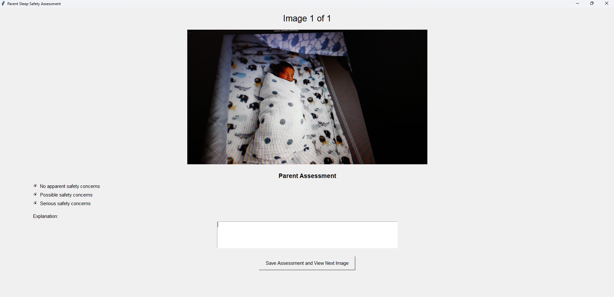

# AI Infant Sleep Monitoring System

Independent study project exploring multimodal AI vision models for infant sleep monitoring.

The system uses a Raspberry Pi Camera Module 3 to capture still images of a sleep environment. The images are transferred to a laptop, processed by multiple multimodal AI models, and stored in a SQLite database. After a monitoring session, a parent reviews the captured images through a basic graphical interface and assigns a reference safety assessment. The parent assessment is then compared with the assessment returned by each AI model.

This project currently evaluates images rather than continuous video.

#### Core Question:
"Can existing multimodal AI models provide assessments of infant sleep environments in a way that is reliable enough to assist parents in infant sleep monitoring?"

## System Requirements
- Raspberry Pi
- Raspberry Pi Camera Module 3
- Windows, macOS, or Linux
- Python 3.12 or newer
- Network access to the Raspberry Pi

## System Architecture

The experimental system consists of a Raspberry Pi and a laptop.

### Raspberry Pi

The part of the system that exist in the Raspberry Pi is responsible for:

- Controlling the Camera Module 3 (**camera_script.py**)
- Capturing high-resolution still images
- Running a Flask camera service (**camera_servicing.py**)
- Responding to HTTP capture requests
- Returning captured JPEG image files to the laptop

### Laptop

The part of the system that exist in the laptop is responsible for:

- Starting a monitoring session (**app.py**)
- Requesting images from the Raspberry Pi via HTTP 
- Saving captured images locally
- Inserting image metadata into SQLite database (**database.py**)
- Processing each image to AI models for assessment (**ai_processing.py**)
- Validating and storing AI responses
- Collecting parent reference assessments (**parent_gui.py**)
- Comparing AI assessments with parent assessments

## Application Workflow

Laptop user begins a monitoring session from the Python application.

(Provides the desired monitoring session duration and image capture interval.)

↓

Laptop sends http POST request to Raspberry Pi /capture endpoint in Flask server.

↓

Raspberry Pi captures a still image using the Camera Module 3 and saves the JPEG locally.

↓

Flask sends the JPEG bytes to the laptop and laptop saves its own local copy.

↓

Image metadata is inserted into SQLite database. 

↓

Image is processed by each AI model using a standardized prompt and JSON response schema.

↓

Valid or invalid AI responses are stored.


↓

Monitoring session finishes and the parent assessment GUI opens.

↓

The parent reviews each captured image and provides a safety assessment.

(Uses the same JSON response structure as the AI models)

↓

Parent assessments are stored in the SQLite database.

↓

The application compares each AI model's assessment with the parent reference assessment.

↓

A comparison table and agreement summary are displayed in the Python console.


## Project Directory Structure

```text
ai-infant-sleep-monitoring-system/
├── database/
│   └── ism.db
│
├── images/
│
├── previews/
│
├── raspberry-pi/
│   ├── camera_script.py
│   ├── camera_servicing.py
│
├── results/
│   └── updated_run/
│       ├── gemini_outputs/
│       ├── gemini_invalid_outputs/
│       ├── openai_outputs/
│       ├── openai_invalid_outputs/
│       ├── anthropic_outputs/
│       ├── anthropic_invalid_outputs/
│       ├── mistral_outputs/
│       └── mistral_invalid_outputs/
│
├── ai_processing.py
├── app.py
├── database.py
├── parent_gui.py
├── preview_camera.py
├── .env
├── .gitignore
└── README.md
```


## How to Run

### Camera Preview

Verify camera placement before starting a monitoring session.

### Run monitoring session

Start the Flask server on the Raspberry Pi so that client request from laptop can be heard.

Run the monitoring application, app.py with set duration and intervals.

After the monitoring session completes, the Parent GUI opens to collect parent assessment.

For each captured image, the parent:
- Reviews the image presented.
- Selects one safety assessment.
- Enters a brief explanation.

### Comparison Analysis

After all parent assessments have been completed, the application:

- Compares each AI model with the parent reference assessment.
- Displays a comparison table.
- Calculates agreement for each AI model.

Agreement (as a percentage) is reported as:
```
Exact Matches / Total Comparisons
```

## Example Monitoring Session

The following example demonstrates a successful monitoring session consisting of a single captured image. The Parent Assessment GUI is displayed after the monitoring session is complete, followed by the comparison results and agreement summary generated by the application.

### Parent Assessment GUI




### Session Comparison Results

| Image File | AI Model | Parent Truth Label | AI Model Label | Exact Match |
|------------|----------|--------------------|----------------|:-----------:|
| capture_20260804_000519.jpg | Claude Sonnet 4-6 | Possible safety concerns | Possible safety concerns |     Yes     |
| capture_20260804_000519.jpg | GPT-4.1 Mini | Possible safety concerns | No apparent safety concerns |     No      |
| capture_20260804_000519.jpg | Gemini 2.5 Flash | Possible safety concerns | No apparent safety concerns |     No      |
| capture_20260804_000519.jpg | Mistral Medium 3.5 | Possible safety concerns | No apparent safety concerns |     No      |

### Assessment Explanations

#### Claude Sonnet 4-6
**Parent Explanation**

> There is a blanket over the bassinet. This can be a potential safety concern.

**AI Model Explanation**

> The newborn is swaddled and placed on their back in what appears to be a bassinet or play yard, which are positive signs. However, there are loose blankets/fabric visible near the top of the sleep surface, and the fitted sheet beneath appears to have some looseness or additional fabric layers. The presence of loose bedding near an infant's head area poses a possible suffocation risk.

---

#### GPT-4.1 Mini
**Parent Explanation**

> There is a blanket over the bassinet. This can be a potential safety concern.

**AI Model Explanation**

> The infant is placed on their back on a firm, flat mattress with a fitted sheet. The baby is swaddled securely with no loose blankets or pillows in the sleep area. There are no soft objects, toys, or bedding around that could pose a suffocation risk. The sleep environment appears to follow recommended safe sleep guidelines.

---
#### Gemini 2.5 Flash
**Parent Explanation**

> There is a blanket over the bassinet. This can be a potential safety concern.

**AI Model Explanation**

> The infant is placed on their back in what appears to be a bassinet or pack-n-play. The sleep surface seems firm, and the baby is swaddled appropriately. There are no loose blankets, pillows, bumpers, or other objects in the sleep area that could pose a suffocation risk.

---

#### Mistral Medium 3.5
**Parent Explanation**

> There is a blanket over the bassinet. This can be a potential safety concern.

**AI Model Explanation**

> The sleep environment appears to be a crib with a fitted sheet and a swaddle blanket. The crib is free of loose bedding, pillows, or toys, and the baby is placed on their back, which aligns with safe sleep guidelines.

### Agreement Summary

| AI Model | Exact Matches | Agreement |
|----------|:-------------:|----------:|
| Claude Sonnet 4-6 | 1 / 1 | **100.0%** |
| GPT-4.1 Mini | 0 / 1 | **0.0%** |
| Gemini 2.5 Flash | 0 / 1 | **0.0%** |
| Mistral Medium 3.5 | 0 / 1 | **0.0%** |


**Disclaimer:** This project investigates the feasibility of multimodal AI models as parent-assistance tools for infant sleep monitoring. It is a research prototype and is not intended to replace caregiver judgment or medical advice.